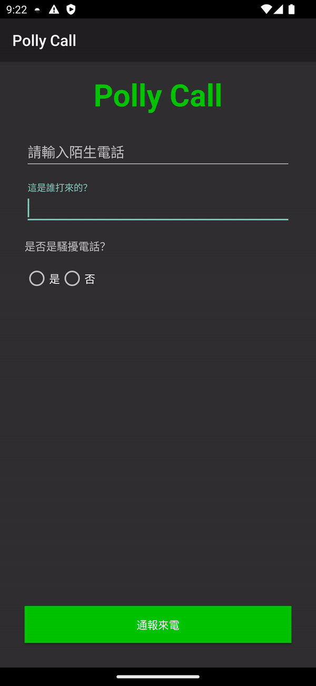

# PollyCall
This is a project that clones the functionality of the Whoscall including frontend and backend. It can identify the caller's identity when the phone is ringing.
User can purchase the premium service by Google Billing Library.
In this project, I execute the backend in the AWS EC2 instance and MySQL with the Django framework.


## Use Path

### Upload the strange number to the server


### get information of the strange number from the server when the phone is ringing


## Architecture


## Features
- [x] Identify the caller's identity when the phone is ringing
- [x] Local database to store the caller's identity
- [x] Notifications to display the caller's identity
- [x] UI to display the form to report the caller's identity


## Skills
- CallScreeningService
- ForegroundService
- BillingClient
- Room
- MVVM
- Retrofit, Moshi
- MVVM
- Hilt
- Python (Django)


## API
Because the API is not stable, before test this app, please test the api in Postman first to make sure the api is working.

### Get the information of the strange number
`GET http://3.25.150.64:8000/catalog/number/all/`

### Upload the strange number
`POST http://3.25.150.64:8000/catalog/number/create/`

payload: 
```
{
    "number": "0912345678",
    "owner": "test",
    "is_scam": false,
}
```

## Installation

### Clone the project
`git clone https://github.com/pollyannagogolook/PollyCall`

## Author
This project is created by Pollyanna Wu in Gogolook. 
